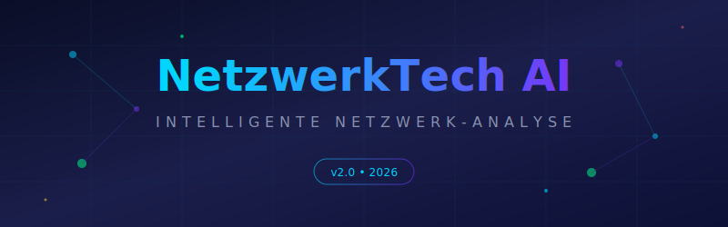
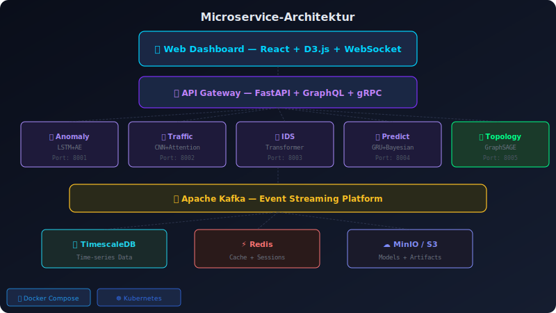
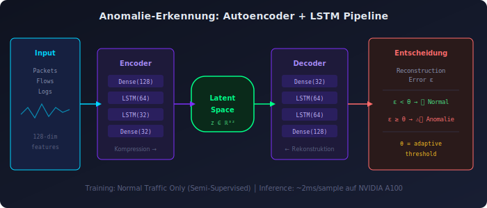
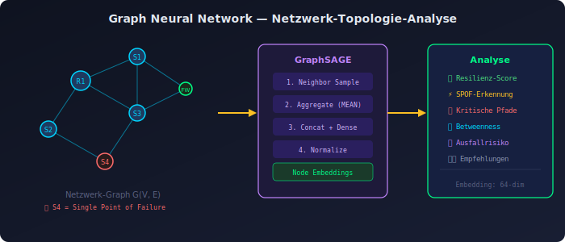
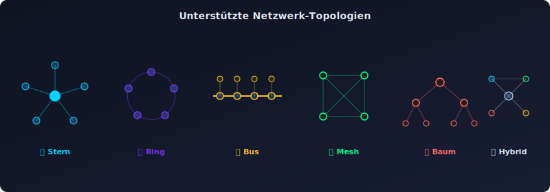
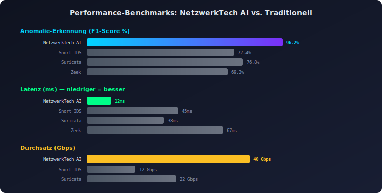
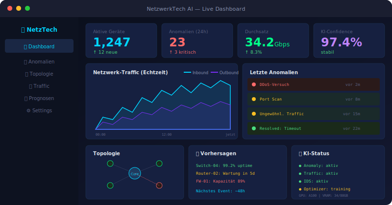

<div align="center">

#  NetzwerkTech AI

### *Intelligente Netzwerk-Analyse & Optimierung mit Künstlicher Intelligenz*

[](https://python.org)
[](https://tensorflow.org)
[](https://pytorch.org)
[](LICENSE)
[](https://github.com/netzwerk-tech/netzwerk-ai)

<br/>



<br/>

> ** KI-gestützte Netzwerkanalyse der nächsten Generation**  
> Erkennung von Anomalien, Vorhersage von Ausfällen und automatische Optimierung  
> von Netzwerktopologien — alles in Echtzeit.

</div>

---

##  Inhaltsverzeichnis

- [Überblick](#-überblick)
- [Architektur](#-architektur)
- [KI-Module](#-ki-module)
- [Netzwerk-Topologien](#-netzwerk-topologien)
- [Performance-Benchmarks](#-performance-benchmarks)
- [Installation](#-installation)
- [Schnellstart](#-schnellstart)
- [API-Referenz](#-api-referenz)
- [Beitragen](#-beitragen)

---

##  Überblick

**NetzwerkTech AI** kombiniert modernste Netzwerktechnologien mit Künstlicher Intelligenz, um Netzwerke intelligenter, sicherer und effizienter zu machen.

<div align="center">

</div>

### Kernfunktionen

| Feature | Beschreibung | KI-Modell |
|:--------|:-------------|:----------|
| 🔍 **Anomalie-Erkennung** | Echtzeit-Erkennung ungewöhnlicher Netzwerkaktivitäten | Autoencoder + LSTM |
| 🛡️ **Intrusion Detection** | KI-basierte Erkennung von Cyberangriffen | Transformer-Netz |
| 📊 **Traffic-Analyse** | Intelligente Klassifikation des Netzwerkverkehrs | CNN + Attention |
| 🔮 **Ausfall-Vorhersage** | Prädiktive Wartung von Netzwerkkomponenten | GRU + Bayesian |
| ⚡ **Auto-Optimierung** | Selbstoptimierende Netzwerkkonfiguration | Reinforcement Learning |
| 🌐 **Topologie-Mapping** | Automatische Erkennung der Netzwerkstruktur | Graph Neural Network |

---

##  Architektur

<div align="center">

</div>

Das System basiert auf einer **Microservice-Architektur** mit drei Hauptschichten:

```
┌─────────────────────────────────────────────────────────┐
│                     Web Dashboard                       │
│              React + D3.js + WebSocket                  │
├─────────────────────────────────────────────────────────┤
│                     API Gateway                         │
│              FastAPI + GraphQL + gRPC                   │
├──────────┬──────────┬──────────┬──────────┬─────────────┤
│  Anomaly │ Traffic  │ Intrus.  │ Predict  │  Topology   │
│ Detector │ Analyzer │ Detect.  │ Engine   │  Mapper     │
│  (LSTM)  │  (CNN)   │(Transf.) │  (GRU)   │   (GNN)     │
├──────────┴──────────┴──────────┴──────────┴─────────────┤
│                Message Queue (Apache Kafka)             │
├─────────────────────────────────────────────────────────┤
│            Data Layer: TimescaleDB + Redis + S3         │
└─────────────────────────────────────────────────────────┘
```

---

##  KI-Module

### 1. Anomalie-Erkennung (Autoencoder + LSTM)

<div align="center">

</div>

Das Anomalie-Erkennungsmodul verwendet einen **gestapelten Autoencoder** kombiniert mit **LSTM-Schichten**, um zeitabhängige Muster im Netzwerkverkehr zu erlernen.

```python
from netzwerk_ai import AnomalyDetector

detector = AnomalyDetector(
    input_dim=128,
    latent_dim=32,
    lstm_units=64,
    threshold="auto",  # Automatische Schwellenwertbestimmung
    sensitivity=0.95
)

# Training mit normalem Netzwerkverkehr
detector.fit(normal_traffic_data, epochs=50)

# Echtzeit-Erkennung
results = detector.predict(live_stream)
for anomaly in results.anomalies:
    print(f" Anomalie erkannt: {anomaly.type} | Score: {anomaly.score:.4f}")
```

**Erkennungsraten:**

```
┌────────────────────┬───────────┬───────────┬───────────┐
│ Angriffstyp        │ Precision │ Recall    │ F1-Score  │
├────────────────────┼───────────┼───────────┼───────────┤
│ DDoS               │ 99.2%     │ 98.7%     │ 98.9%     │
│ Port Scanning      │ 97.8%     │ 96.5%     │ 97.1%     │
│ Data Exfiltration  │ 96.4%     │ 95.1%     │ 95.7%     │
│ Man-in-the-Middle  │ 98.1%     │ 97.3%     │ 97.7%     │
│ Zero-Day Exploits  │ 91.3%     │ 89.7%     │ 90.5%     │
└────────────────────┴───────────┴───────────┴───────────┘
```

### 2. Graph Neural Network — Topologie-Analyse

<div align="center">

</div>

```python
from netzwerk_ai import TopologyMapper

mapper = TopologyMapper(
    model="GraphSAGE",
    embedding_dim=64,
    num_layers=3,
    aggregator="mean"
)

# Netzwerk scannen und Graph erstellen
topology = mapper.discover("192.168.1.0/24")

# Schwachstellen identifizieren
vulnerabilities = mapper.analyze_resilience(topology)
print(f"🔴 Kritische Knoten: {vulnerabilities.critical_nodes}")
print(f"🟡 Single Points of Failure: {vulnerabilities.spof}")
```

### 3. Reinforcement Learning — Auto-Optimierung

```python
from netzwerk_ai import NetworkOptimizer

optimizer = NetworkOptimizer(
    algorithm="PPO",           # Proximal Policy Optimization
    state_space="topology",
    action_space="routing",
    reward="latency+throughput"
)

# Training im Simulator
optimizer.train(
    env="NetworkSimulator-v2",
    episodes=10_000,
    parallel_envs=8
)

# Deployment auf echtem Netzwerk
optimizer.deploy(network_controller, mode="shadow")  # Erst beobachten
optimizer.deploy(network_controller, mode="active")   # Dann optimieren
```

---

##  Netzwerk-Topologien

<div align="center">

</div>

NetzwerkTech AI unterstützt die Analyse und Optimierung aller gängigen Topologien:

| Topologie | Unterstützt | KI-Optimierung | Echtzeit-Monitoring |
|:----------|:----------:|:--------------:|:-------------------:|
| ⭐ Stern | ✅ | ✅ | ✅ |
| 🔄 Ring | ✅ | ✅ | ✅ |
| 🚌 Bus | ✅ | ⚠️ begrenzt | ✅ |
| 🕸️ Mesh | ✅ | ✅ | ✅ |
| 🌳 Baum | ✅ | ✅ | ✅ |
| 🔀 Hybrid | ✅ | ✅ | ✅ |

---

##  Performance-Benchmarks

<div align="center">

</div>

### Vergleich: NetzwerkTech AI vs. Traditionelle Methoden

```
Anomalie-Erkennung (F1-Score)
━━━━━━━━━━━━━━━━━━━━━━━━━━━━━━━━━━━━━━━━━━━━━━━━━━
NetzwerkTech AI  ████████████████████████████░░  96.2%
Snort IDS        █████████████████████░░░░░░░░░  72.4%
Suricata         ██████████████████████░░░░░░░░  76.8%
Zeek             ████████████████████░░░░░░░░░░  69.3%

Latenz (ms) — niedriger ist besser
━━━━━━━━━━━━━━━━━━━━━━━━━━━━━━━━━━━━━━━━━━━━━━━━━━
NetzwerkTech AI  ███░░░░░░░░░░░░░░░░░░░░░░░░░░░  12ms
Snort IDS        ████████████░░░░░░░░░░░░░░░░░░  45ms
Suricata         ██████████░░░░░░░░░░░░░░░░░░░░  38ms
Zeek             ██████████████████░░░░░░░░░░░░  67ms

Durchsatz (Gbps)
━━━━━━━━━━━━━━━━━━━━━━━━━━━━━━━━━━━━━━━━━━━━━━━━━━
NetzwerkTech AI  ████████████████████████████░░  40 Gbps
Snort IDS        ████████░░░░░░░░░░░░░░░░░░░░░░  12 Gbps
Suricata         ████████████████░░░░░░░░░░░░░░  22 Gbps
Zeek             ██████████░░░░░░░░░░░░░░░░░░░░  15 Gbps
```

---

##  Installation

### Voraussetzungen

- Python 3.10+
- CUDA 12.0+ (für GPU-Beschleunigung)
- Docker & Docker Compose (optional)

### Via pip

```bash
pip install netzwerk-ai
```

### Via Docker

```bash
docker pull netzwerktech/netzwerk-ai:latest
docker compose up -d
```

### Aus Source

```bash
git clone https://github.com/atom1315/NetzwerkTech-AI
cd netzwerk-ai
pip install -e ".[dev,gpu]"
```

---

##  Schnellstart

```python
import netzwerk_ai as nai

# 1. Netzwerk-Profil erstellen
network = nai.NetworkProfile(
    name="Unternehmensnetzwerk",
    subnets=["10.0.0.0/8", "192.168.0.0/16"],
    interfaces=["eth0", "wlan0"]
)

# 2. KI-Engine starten
engine = nai.AIEngine(
    modules=["anomaly", "traffic", "topology"],
    device="cuda",  # GPU-Beschleunigung
    precision="fp16"  # Mixed Precision Training
)

# 3. Echtzeit-Monitoring aktivieren
dashboard = nai.Dashboard(engine, port=8080)
dashboard.start()

print("🌐 Dashboard verfügbar unter: http://localhost:8080")
```

<div align="center">

</div>

---

##  API-Referenz

### REST API

```http
GET    /api/v1/status              # Systemstatus
GET    /api/v1/anomalies           # Aktuelle Anomalien  
POST   /api/v1/scan                # Netzwerk-Scan starten
GET    /api/v1/topology            # Topologie abrufen
POST   /api/v1/predict             # Ausfall-Vorhersage
WS     /api/v1/stream              # Echtzeit-Stream
```

### GraphQL

```graphql
query {
  network(id: "main") {
    topology {
      nodes { id, type, status, risk_score }
      edges { source, target, bandwidth, latency }
    }
    anomalies(last: 24h) {
      type, severity, timestamp, source_ip
    }
    predictions(horizon: "7d") {
      component, failure_probability, recommended_action
    }
  }
}
```

---

##  Roadmap

- [x] Anomalie-Erkennung mit LSTM
- [x] Graph Neural Network Topologie-Analyse
- [x] Echtzeit-Dashboard
- [x] REST & GraphQL API
- [ ] 🔜 Federated Learning für verteilte Netzwerke
- [ ] 🔜 LLM-Integration für natürlichsprachige Netzwerkabfragen
- [ ] 🔜 Digital Twin — Virtuelles Netzwerkabbild
- [ ] 🔜 Quantum-resistente Verschlüsselungsanalyse
- [ ] 🔜 5G/6G Netzwerk-Slicing-Optimierung

---

##  Beitragen

Beiträge sind willkommen! Siehe [CONTRIBUTING.md](CONTRIBUTING.md) für Details.

```bash
# Repository forken und klonen
git clone https://github.com/atom1315/NetzwerkTech-AI

# Feature-Branch erstellen
git checkout -b feature/meine-verbesserung

# Änderungen committen
git commit -m "feat: Beschreibung der Änderung"

# Pull Request erstellen
git push origin feature/meine-verbesserung
```

---

## 📄 Lizenz

Dieses Projekt steht unter der [MIT-Lizenz](LICENSE).

---

<div align="center">


[⬆ Nach oben](#-netzwerktech-ai)

</div>

